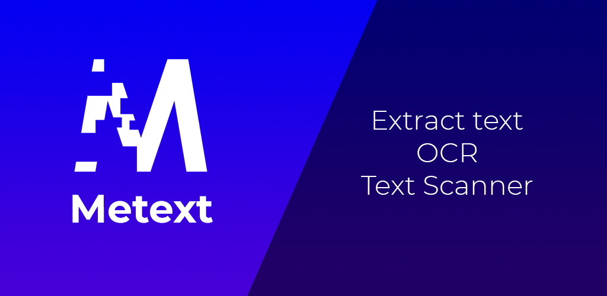

# Metext

OCR Scanner app, available for [iOS](https://apps.apple.com/us/app/metext-text-scanner-ocr/id1510120975) and [Android](https://play.google.com/store/apps/details?id=it.mattianatali.metext)

## Getting Started

- It is made with [Flutter](https://flutter.io/)
- Android deployment is automated with [fastlane](https://fastlane.tools/)
- Secret are kept secure with [git-crypt](https://github.com/AGWA/git-crypt)
- [Landing page](https://metext.mattianatali.com/)

## Deployment

- Android: `make deploy-android`
- iOS: `make bundle-ios`. Then upload the ipa with [transporter](https://apps.apple.com/it/app/transporter/id1450874784?mt=12)
